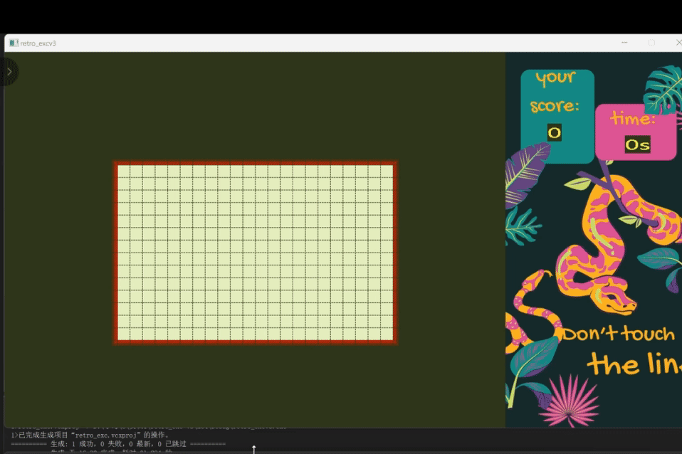
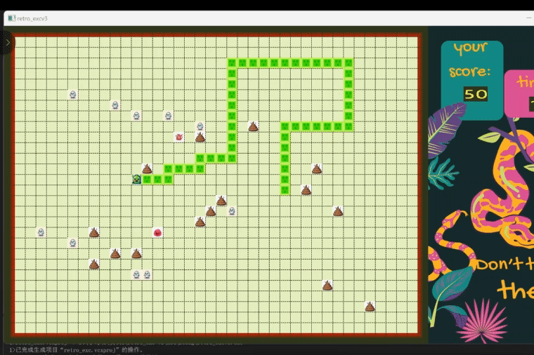
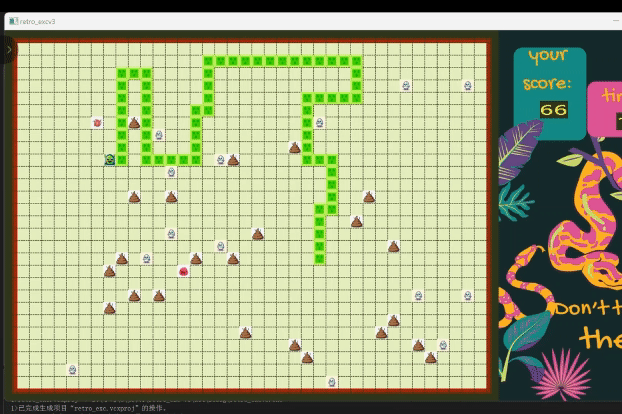
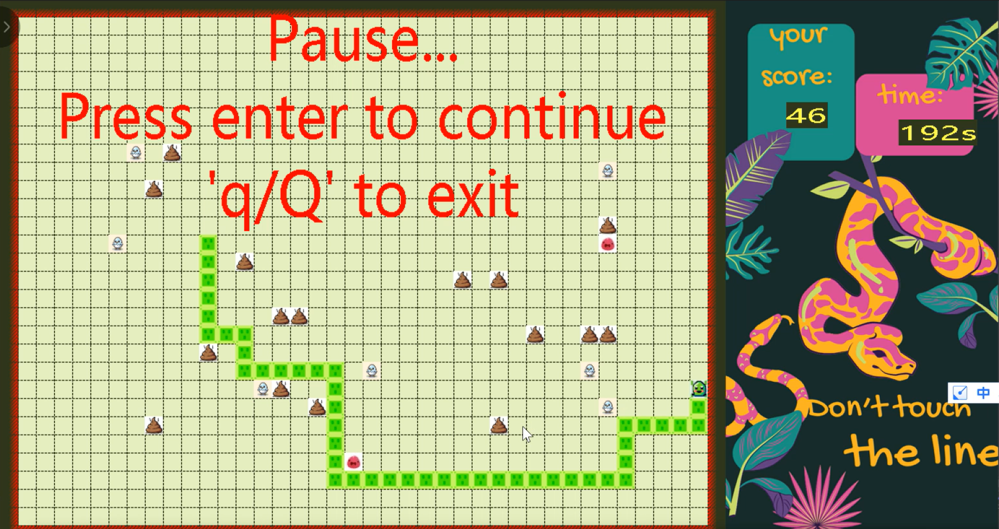
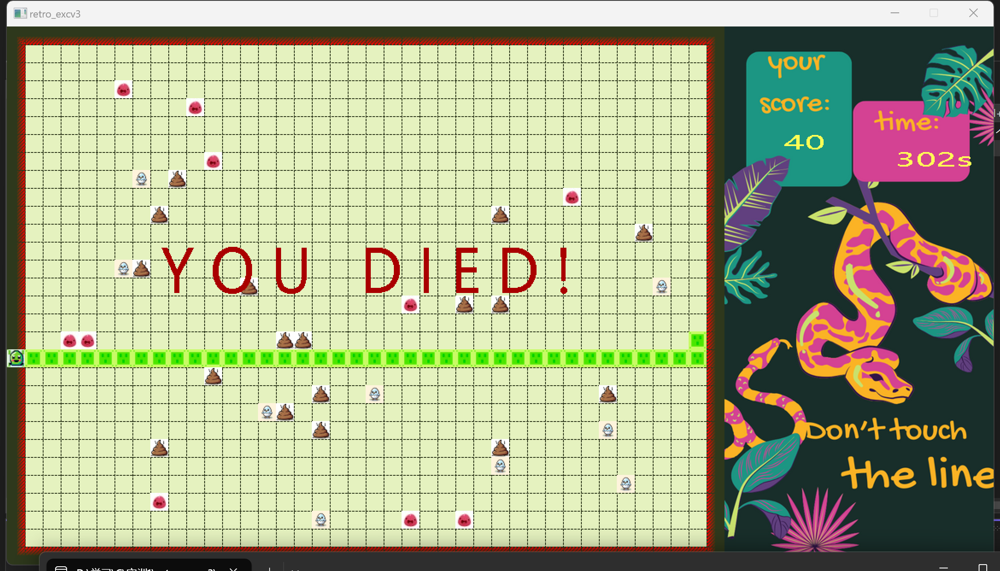

# Retro Snake with EasyX

<p align="center">
  
</p>

<p align="center">
  一个基于 <strong>C++ + EasyX</strong> 实现的机制化贪吃蛇小游戏。<br>
  不是只做基础移动和吃食物，而是在经典玩法上加入了关卡解锁、负面果实、冲刺果实、追击机制、隐身效果和动态难度设计。
</p>

---

## 项目简介

这个项目是一个运行在 Windows 图形界面下的贪吃蛇游戏，仓库内已经包含 Visual Studio 解决方案、主程序源码、图片资源、音频资源和演示视频。  
主逻辑集中在 `retro_exc/No one can exceed 60 points.cpp` 中，项目文件为 `retro_exc.sln` 和 `retro_exc/retro_exc.vcxproj`。游戏使用 `graphics.h`、`conio.h`、`windows.h` 等 Windows 图形与输入接口，并采用 EasyX 风格的绘图方式实现界面与交互。

## 功能特点

### 1. 不是“基础作业版”贪吃蛇
这个项目不止有蛇的移动、增长和死亡判定，还做了比较完整的玩法扩展：

- **三阶段地图变化**  
  游戏初始存在边框缩放参数，蛇长达到 **20** 和 **45** 时会触发阶段切换，地图扩大，玩法继续加码。
- **四类机制对象**
  - **普通增长果实**：吃到后增长
  - **负面果实**：吃到后会缩短蛇身
  - **冲刺果实**：吃到后会触发连续前冲
  - **追击/隐身机制对象**：会朝蛇头移动，接触后触发隐身状态
- **动态难度**
  - 分数增长后，负面果实会持续生成
  - 蛇身越长，移动速度越快
  - 第二、三阶段会逐渐引入更强的压迫感机制

### 2. 界面不是纯字符输出
项目使用图像资源绘制蛇头、蛇身、果实和右侧信息栏，并在界面中显示：

- 当前得分
- 实时计时
- 暂停提示
- 死亡提示

### 3. 有完整交互流程
支持开始提示、游戏中暂停、继续、退出、结算结束等完整流程，不是只写一个循环让蛇移动。

---

## 玩法说明

### 基本操作

- `W / A / S / D`：控制移动方向
- `Space`：暂停
- `Enter`：暂停后继续
- `Q`：退出游戏

### 机制说明

- **增长果实**：提供基础成长
- **负面果实**：属于风险机制，蛇长较短时有保护逻辑
- **冲刺果实**：吃到后会向当前方向额外前进若干步
- **追击对象**：会主动靠近蛇头，命中后让蛇暂时进入隐身状态
- **速度变化**：蛇身长度增加后，休眠时间递减，整体节奏变快

---

## 界面展示

### 游戏开始

<p align="center">
  
</p>

### 游戏进行中

<p align="center">
  
  
</p>

### 暂停界面与结束界面

<p align="center">
  
  
</p>

---

## 项目结构

```text
retroSnake-with-easyX
├─ retro_exc
│  ├─ No one can exceed 60 points.cpp   # 主程序
│  ├─ retro_exc.vcxproj                 # VS 项目文件
│  ├─ card.png                          # 右侧信息栏背景
│  ├─ head.png / body.png / tail.png    # 蛇身资源
│  ├─ food.png / shit.png               # 普通与负面果实
│  ├─ speed_food.jpg / steal.jpg        # 特殊机制对象
│  ├─ better-day.wav                    # 背景音乐
│  └─ ...
├─ retro_exc.sln                        # VS 解决方案
├─ retrosnake2311475朱婧萱.mp4          # 演示视频
└─ README.md
```

---

## 技术实现

### 开发环境
- C++
- EasyX
- Visual Studio 工程
- Windows 图形接口

### 实现要点
- 使用 `vector` 存储蛇身和多类果实坐标
- 使用批量绘制减少闪烁
- 使用随机数生成果实位置
- 通过长度阈值触发关卡推进
- 通过状态变量管理隐身与追击逻辑
- 通过计时与休眠控制游戏速度变化

---

## 运行方式

### 方式一：直接使用 Visual Studio
1. 克隆仓库
2. 用 Visual Studio 打开 `retro_exc.sln`
3. 确保本机已经配置 EasyX 图形库
4. 编译并运行项目

### 方式二：查看演示视频
如果你只是想先看效果，可以直接打开仓库中的演示视频：

- [演示视频](./retrosnake2311475朱婧萱.mp4)

---

## 这个项目做了什么

相较于“只完成课程要求”的基础贪吃蛇，这个版本重点做了两件事：

1. **把玩法做复杂**  
   不是简单增加贴图，而是加入了阶段切换、成长与惩罚联动、冲刺、追击、隐身等机制，使游戏从“基础练手”变成一个有节奏变化和压力设计的小型作品。

2. **把展示做完整**  
   除了源码，仓库里还保留了图像资源、音频资源和演示视频，适合直接作为课程项目展示页。

---

## 后续可改进方向

- 将单文件源码继续拆分为多个模块，例如 `snake`、`food`、`ui`、`game` 四部分
- 增加配置项，例如初始速度、地图尺寸、音效开关
- 增加排行榜或本地最高分存档
- 增加更稳定的资源路径管理，避免依赖当前工作目录
- 补充 Release 可执行文件与版本截图，进一步提升仓库展示效果

---

## 致谢

这个项目保留了比较鲜明的个人风格：  
机制设计不是照搬标准模板，而是在经典贪吃蛇框架里加入了自己对“好玩”和“压迫感”的理解。

如果你觉得这个项目有意思，欢迎点个 Star。
